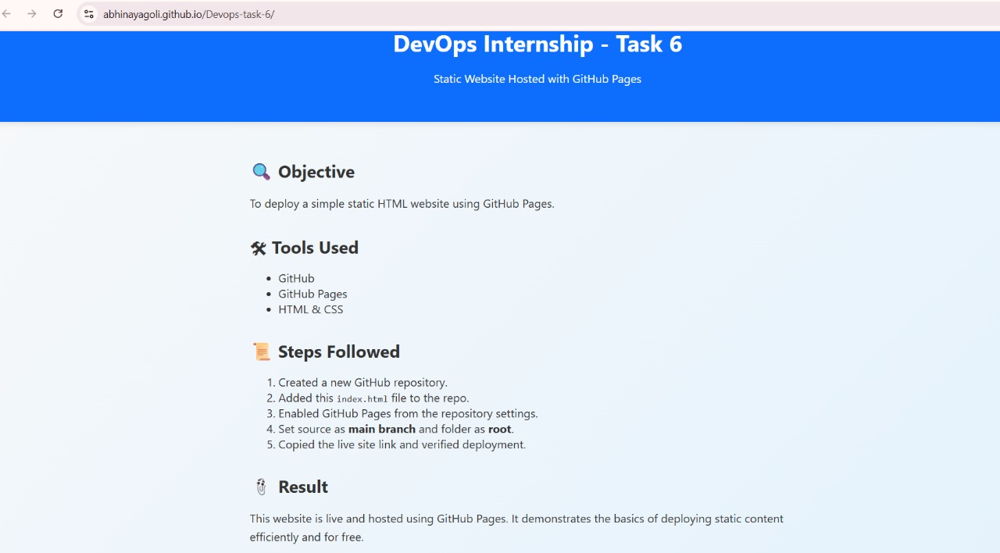

# 🚀 DevOps Internship - Task 6

**Task:** Host a Static Website with GitHub Pages  
**Status:** ✅ Completed and Deployed

🔗 **Live Website:** [Click Here](https://abhinayagoli.github.io/Devops-task-6/)

---

## 📌 Objective
To deploy a simple static HTML website using **GitHub Pages** as part of the DevOps internship task.

---

## 🛠 Tools Used
- GitHub
- GitHub Pages
- HTML & CSS

---

## 📜 Steps Followed
1. Created a new GitHub repository.
2. Added an `index.html` file to the repo.
3. Enabled GitHub Pages from the repository settings.
4. Set the source as `main` branch and folder as `root`.
5. Copied the live site link and verified the deployment.

---

## 🎯 Result
The static site is live and accessible using the GitHub Pages link.  
This task demonstrates how to deploy static content for free using GitHub Pages.

---

## 📸 Screenshot

---

## 🙋 Interview Prep Questions
- What is GitHub Pages?
- Can you host dynamic apps here?
- What are the limits of GitHub Pages?
- How do you update the website?
- What happens when you delete the repo?
- What is the default file that loads?
- Can you use a custom domain?

---

✅ **Submitted by:** Abhinay Agoli  
🎓 **Task:** DevOps Internship - Task 6
